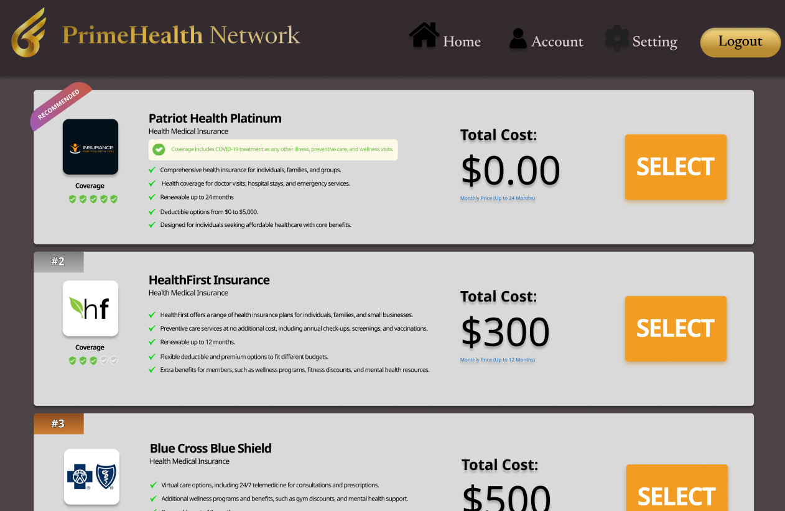

# CSC 325 Project: PrimeHealth Network Application

# Overview
The PrimeHealth Network Application is designed to help users easily manage their health insurance details. Users can create an account, input their information, and browse recommended health insurance plans based on their preferences and personal details. This application aims to provide a user-friendly interface to simplify the process of selecting the most suitable health insurance plan. 

# Features
Login/Sign-Up Page: Create a new account or log in to access your personalized health insurance details.
Home Page: Navigate through the app's features, including viewing and managing your health insurance information.
Select Insurance Plan Page: Explore and choose health insurance plans tailored to your needs based on preferences and personal information.

# Technologies Used
IntelliJ IDEA: Primary development environment for coding and project management.
Java JDK: Backend programming language used to implement core functionality.
Maven: Dependency management tool to handle project dependencies.
JavaFX: UI framework for creating rich and responsive desktop interfaces using FXML-based layouts.
Firebase Admin SDK: Used for server-side storage and user authentication.

# Intended Users
The app is designed for individuals who want a simple and efficient way to manage their health insurance details and explore suitable plans based on their preferences, budget, and personal needs.

# Features Breakdown
1. Login/Sign-Up Page
Login: Enter your username and password to access your account and manage your health insurance plans.
Sign-Up: Create a new account by providing your basic information. This will allow you to save and access your health insurance details securely.
About Us: Provides information about the app, including its purpose, features, and how it can help users choose the right health insurance plan.

2. Insurance Plan Page
View recommended health insurance plans based on your personal details and preferences.
Select a plan that suits your healthcare needs, budget, and coverage requirements.

# Insurance Plan Page
View recommended insurance plans based on your details.  
Select the plan that best fits your needs.

# Installation and Setup
To get started with the PrimeHealth Network application, follow these steps:

1. Clone the Repository

2. git clone https://github.com/yourusername/primehealth-network.git

3. Install Dependencies The project uses Maven for dependency management. Run the following command to install the necessary dependencies:

4. mvn install
Configure Firebase

5. Set up Firebase Admin SDK by following the Firebase setup instructions here.
6. Download the Firebase credentials JSON file and add it to the project’s resource folder.
7. Run the Application- You can run the application directly from IntelliJ IDEA, or use the following command in the terminal:
mvn javafx:run

Future Enhancements
Add more advanced filtering options for selecting insurance plans based on specific criteria (e.g., price range, coverage type).
Implement notifications for users to remind them about insurance renewal dates.
Integrate a payment gateway for users to purchase insurance directly from the app.

# Images

