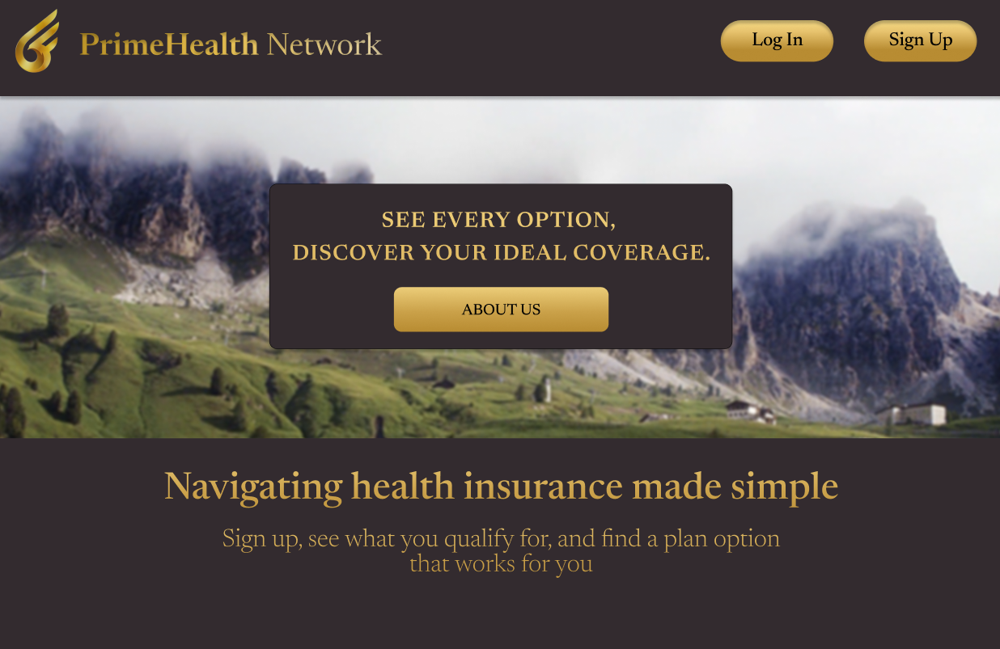

# CSC 325 Project: PrimeHealth Network Application

# Overview
The Health Insurance App is designed to help users easily manage their health insurance details. Users can create an account, input their information, and browse recommended health insurance plans based on their preferences and details.

# Features
Login/Sign-Up Page: Create a new account or log in to access your information.  
Home Page: View and navigate through the app's features.  
Select Insurance Plan Page: Explore and choose health insurance plans tailored to your needs.  
# Technologies Used
IntelliJ IDEA: Primary development environment.  
Java JDK: Backend programming language.  
Maven: Dependency management tool.  
JavaFX: For UI components, controls, and FXML-based layouts.  
Firebase Admin SDK: Server-side storage and authentication.  
# Intended Users
The app is designed for individuals seeking a simple and efficient way to manage their health insurance and explore suitable plans.
# Page Descriptions
Login/Sign-Up Page  
Login: Enter your username and password to access your account.  
Sign-Up: Create an account by providing required information.  
About Us: Learn more about the app's purpose and offerings, displays a summary of what the app provides, including benefits and features.

# Insurance Plan Page
View recommended insurance plans based on your details.  
Select the plan that best fits your needs.

# Images

